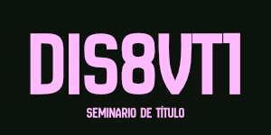
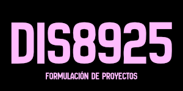
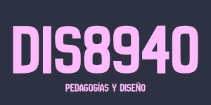
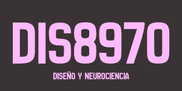
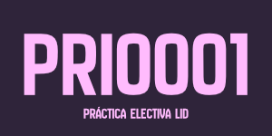
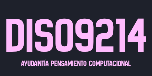
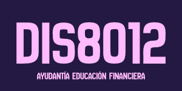

<!-- HEADER -->
<div align="center">

<br/>

```
╔══════════════════════════════════════════════════════╗
║           CORTE ESTUDIOSO  ·  2026-1                 ║
╚══════════════════════════════════════════════════════╝
```


</div>

---

## `◈` Asignaturas

<table>
  <tr>
    <td align="center" width="50%">
      <a href="https://github.com/clifford1one-corteEstudioso/dis8vt1-2026-1">
        
      </a>
      <br/>
      <sub><b>DIS8VT1</b> · Seminario de Título</sub>
    </td>
    <td align="center" width="50%">
      <a href="https://github.com/clifford1one-corteEstudioso/dis8925-2026-1">
        
      </a>
      <br/>
      <sub><b>DIS8925</b> · Formulación de Proyectos</sub>
    </td>
  </tr>
  <tr>
    <td align="center" width="50%">
      <a href="https://github.com/clifford1one-corteEstudioso/dis8940-2026-1">
        
      </a>
      <br/>
      <sub><b>DIS8940</b> · Pedagogías y Diseño</sub>
    </td>
    <td align="center" width="50%">
      <a href="https://github.com/clifford1one-corteEstudioso/dis8970-2026-1">
        
      </a>
      <br/>
      <sub><b>DIS8970</b> · Diseño y Neurociencia</sub>
    </td>
  </tr>
</table>

---

## `◈` Práctica Electiva

<table>
  <tr>
    <td align="center" width="50%">
      <a href="https://github.com/clifford1one-corteEstudioso/fad9100-2026-1">
        
      </a>
      <br/>
      <sub><b>PRI0001</b> · Práctica Electiva LID</sub>
    </td>
  
  </tr>
</table>

---

## `◈` Ayudantías

<table>
  <tr>
    <td align="center" width="50%">
      <a href="https://github.com/clifford1one-corteEstudioso/ay-dis09214-2026-1">
        
      </a>
      <br/>
      <sub><b>DIS09214</b> · Ayudantía Pensamiento Computacional</sub>
    </td>
    <td align="center" width="50%">
      <a href="https://github.com/clifford1one-corteEstudioso/ay-dis8012-2026-1">
        
      </a>
      <br/>
      <sub><b>DIS8012</b> · Ayudantía Educación Financiera</sub>
    </td>
  </tr>
</table>


---

